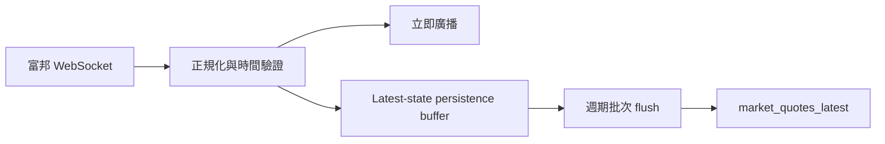

# QuantVision 系統進階效能優化逐階段修改與驗收規畫

**版本**：v1.0

**建立日期**：2026-07-23

**前置規畫**：`docs/terminal-performance-architecture-plan.md`（Phase 0～6）

**適用分支基準**：`codex/realtime-reliability-phases` / `847c792`

**規畫性質**：後續修改、測試、效能比較、驗收、回滾與 Git 提交的執行依據

**目前狀態**：僅完成分析與規畫，Phase 7～15 尚未開始修改

---

## 1. 規畫目的

Phase 0～6 已經完成 DB-first 期貨 K 線、路由導向載入、bounded API、GZip、圖表引擎動態載入、production SPA 與 IndexedDB 快取。實際量測顯示，期貨 K 線 HTTP API 已不再是重新整理頁面的主要瓶頸。

本規畫接續處理下列進階問題：

1. 修正 production build 實際相依圖與原設計不一致，導致兩套圖表引擎仍進入終端載入鏈。
2. 消除富邦即時報價「先寫資料庫、再廣播」造成的行情延遲與資料庫連線競爭。
3. 降低每筆 quote／books 訊息引發的 Vue reactive、K 線陣列重建與完整圖表重繪。
4. 讓 Legacy 與 LWC 圖表都能區分「最後一根更新」和「整批資料變更」。
5. 讓期貨 `limit`、`since`、`warmup` 真正在 MySQL 查詢階段生效。
6. 避免回測、資產報價刷新與背景同步阻塞 FastAPI event loop 或耗盡共用 DB pool。
7. 將 `useDashboard()` 的功能模組和狀態依工作區拆分，降低首次解析、初始化與常駐 watcher。
8. 建立可重複的即時行情、event-loop、DB pool、bundle graph 與 browser Long Task 效能 Gate。

本規畫不重寫整套系統、不導入真實下單、不改變既有分析結果定義，也不以微服務、Redis 或增加 Uvicorn worker 作為第一優先解法。

---

## 2. 已確認的現況基準

### 2.1 期貨 K 線 API

量測條件：

- 商品：`*TMFF`
- 週期：1 分 K
- `period=1d`
- `limit=400`
- `warmup=250`
- 本機 MySQL
- Git 基準：Phase 6 完成後

| 指標 | Cold | Warm |
|---|---:|---:|
| TTFB median | 31.17 ms | 30.64 ms |
| TTFB p95 | 49.47 ms | 35.07 ms |
| Total median | 32.20 ms | 30.99 ms |
| Total p95 | 54.03 ms | 35.58 ms |
| 未壓縮 JSON | 76,296 bytes | 76,296 bytes |
| GZip | 7,881 bytes | 7,881 bytes |
| 回傳 K 棒 | 400 | 400 |

基準檔案：`docs/performance/phase-6-final.json`

判讀：

- 一般 K 線 API 已遠低於原本 5～6 秒。
- 下一階段不應優先導入 Redis 或重新設計 API 格式。
- 仍需解決 DB 查詢讀取範圍大於實際回傳範圍的成長性問題。

### 2.2 Production bundle

2026-07-23 重新執行 `npx vite build --manifest`：

| Chunk | GZip |
|---|---:|
| Entry | 12.02 KB |
| App | 62.48 KB |
| Terminal workspace | 24.48 KB |
| Legacy chart engine | 56.00 KB |
| LWC chart engine | 68.57 KB |
| Route shell／view | 約 1 KB |
| 終端主要初始 JS 相依總量 | 約 225 KB |

Manifest 顯示：

- `index.html` 靜態 import `legacy-chart-engine`。
- `ProChartTerminalWorkspace` 的 imports 同時包含 Legacy 與 LWC chunk。
- `legacy-chart-engine` 內含 Vue runtime 與共用程式，並非純粹的 Legacy engine。

判讀：

- 原本 source-level 的動態 `import()` 存在，但最終 bundle graph 沒有達到引擎互斥。
- Phase 4 的驗收必須補上 build manifest Gate，不能只以原始碼是否使用 `import()` 判斷。

### 2.3 即時報價後端路徑

目前 aggregates／trades 路徑：

```text
富邦 WebSocket
→ get_market_quote()
→ 合併欄位
→ upsert_market_quote()
→ get_market_quote()
→ broadcast_to_ticker()
```

單筆訊息可能造成：

- 一次既有報價 SELECT。
- 一次 INSERT ... ON DUPLICATE KEY UPDATE。
- 一次寫入後 SELECT。
- 資料庫完成後才向前端廣播。

判讀：

- 盤中高頻 trades 會放大 DB round trip。
- DB pool、背景 recorder、API 查詢共享資源時，行情廣播延遲可能累積。
- `market_quotes_latest` 只需要保存「最新狀態」，不需要每筆 trade 都同步落盤。

### 2.4 即時報價前端路徑

目前每筆 quote 會：

```text
WebSocket message
→ mergeRealtimeQuote()
→ Object.assign(reactive quote)
→ 複製 rawOhlcData
→ 更新最後一根 K
→ ohlcData computed
→ 圖表 watcher
→ requestAnimationFrame renderAll()
```

目前 `rawOhlcData` 為 deep reactive `ref([])`，Legacy engine 對完整 `props.ohlcData` 使用 deep watcher，`renderAll()` 會依序呼叫全部主圖與副圖 renderer。

### 2.5 期貨 DB 查詢

目前 `load_futopt_ohlc_db_first()`：

- 依序讀取 requested alias 與 canonical symbol。
- service 取得完整 period rows。
- router 最後才套用 `since`／`limit`／`warmup`。
- refresh 後再次依序讀取全部 storage tickers。

判讀：

- 現在約 1,500 根時延遲不明顯。
- 資料累積到數十萬根後，查詢、Python merge、序列化前暫存都會放大。

### 2.6 CPU 工作

目前回測函式直接在 async route 內同步執行。固定資料的本機診斷：

| K 棒數量 | 同步回測時間 |
|---|---:|
| 2,500 | 約 10.61 ms |
| 20,000 | 約 79.25 ms |
| 100,000 | 約 396.41 ms |

判讀：

- 長期間 1 分 K 回測可能阻塞 event loop 數百毫秒。
- 單人使用不代表可以阻塞 event loop；同一時間仍有行情、WebSocket heartbeat、DB API 與 recorder。

### 2.7 可觀測性缺口

目前已有：

- Request ID。
- `Server-Timing: total`。
- `qv:app-mounted`、`qv:terminal-visible`、`qv:chart-data-ready`、`qv:chart-painted` marks。
- HTTP benchmark。

目前缺少：

- DB pool acquire wait。
- DB query、provider、persistence、serialization 分段時間。
- 富邦訊息 ingress → broadcast 延遲。
- 即時 persistence queue 深度與年齡。
- WebSocket message → browser paint 延遲。
- Long Task 與 event-loop lag。
- 自動檢查 build manifest 是否同時載入兩套 engine。

---

## 3. 最終效能目標

所有數值都必須使用同一台電腦、production build、本機 MySQL、相同測試商品與相同資料量比較。不得挑選單次最快結果作為驗收。

### 3.1 重新整理與 bundle

| 指標 | 必須通過 | 理想值 |
|---|---:|---:|
| 終端 shell 可見 | p95 ≤ 500 ms | median ≤ 300 ms |
| IndexedDB 快取可用時首張 K 線 | p95 ≤ 800 ms | median ≤ 500 ms |
| DB-first 首張 K 線 | p95 ≤ 1,200 ms | median ≤ 700 ms |
| 終端初始 JS gzip | ≤ 190 KB | ≤ 175 KB |
| 終端初始 script request | ≤ 9 | ≤ 7 |
| 未選用圖表引擎下載量 | 0 KB | 0 KB |
| 首次畫面外部字型請求 | 0 | 0 |
| 首次載入 > 100 ms Long Task | 0 | 0 |

### 3.2 即時行情

| 指標 | 必須通過 | 理想值 |
|---|---:|---:|
| Backend ingress → broadcast p95 | ≤ 75 ms | ≤ 50 ms |
| Backend ingress → broadcast max（正常負載） | ≤ 200 ms | ≤ 100 ms |
| 前端 message → paint p95 | ≤ 120 ms | ≤ 80 ms |
| 單商品報價 DB persistence | ≤ 2 次／秒 | 1 次／秒 |
| Persistence queue age p95 | ≤ 500 ms | ≤ 250 ms |
| 正常負載 queue drop | 0 | 0 |
| 60 秒行情期間 > 50 ms Long Task | ≤ 2 | 0 |
| 五檔、最新價、K 線時間一致 | 100% | 100% |

### 3.3 資料庫與 K 線

| 指標 | 必須通過 | 理想值 |
|---|---:|---:|
| DB-first 期貨 API warm p95 | ≤ 35 ms | ≤ 25 ms |
| DB query 分段 p95 | ≤ 20 ms | ≤ 15 ms |
| Interactive DB pool wait p95 | ≤ 10 ms | ≤ 5 ms |
| `limit=400` 單 ticker DB 回傳列數 | ≤ effective limit | = effective limit 或實際較少筆數 |
| `since` 查詢是否在 SQL 生效 | 必須 | 必須 |
| alias／canonical 合併結果重複時間 | 0 | 0 |

### 3.4 CPU 工作與背景負載

| 指標 | 必須通過 | 理想值 |
|---|---:|---:|
| 100,000 根回測期間 event-loop lag p95 | ≤ 30 ms | ≤ 20 ms |
| 100,000 根回測期間 event-loop lag max | ≤ 100 ms | ≤ 50 ms |
| 回測結果與修改前 fixture | 完全一致 | 完全一致 |
| 背景同步期間 API p95 劣化 | < 30% | < 15% |
| Asset quote 同商品重複請求 | 0 | 0 |

---

## 4. 共通架構原則

### 4.1 保留模組化單體

- 保留 FastAPI、MySQL、Vue SPA。
- 不在本規畫中導入 Redis、Kafka、RabbitMQ 或微服務。
- 不增加 Uvicorn worker；富邦登入與 WebSocket 維持單一 session owner。

### 4.2 即時路徑優先

資源優先順序：

1. 富邦訊息接收與前端廣播。
2. 使用者互動 API 與 DB read。
3. 1 分 K recorder 與最新報價 persistence。
4. 警報、資產估值刷新。
5. 歷史補齊、新聞、完整市場同步、備份。

低優先工作不得阻塞高優先工作。

### 4.3 Latest-state coalescing

只適用於「最新狀態」：

- `market_quotes_latest`
- 五檔最新 snapshot
- 前端即時顯示

不得套用到：

- 1 分 K 正式持久化資料
- 交易日誌
- 資產現金流
- 已實現／未實現交易
- 警報觸發紀錄

### 4.4 Cache 與 queue 必備條件

每個新增 cache／queue 必須具備：

- 容量上限。
- TTL 或 flush interval。
- single-flight／去重策略。
- overload 行為。
- dropped／coalesced 計數。
- shutdown drain。
- 例外消費與狀態查詢。
- 測試用 deterministic clock 或可注入時間。

### 4.5 不可破壞的功能

- `*TMFF`／`*TXFF` 動態近月解析。
- 富邦 reconnect 與重新訂閱。
- 即時五檔完整 5 買＋5 賣。
- 期貨 1 分 K 寫入 MySQL，重啟後可重建。
- DB-first 與富邦斷線 fallback。
- Legacy／LWC 圖表切換。
- 畫線、指標、副圖與比較商品。
- 觀察池、警報、通知、日誌、回測、資產頁。
- 所有既有 API 欄位、資料表與舊自動化腳本。
- 系統只分析、觀察與回測，不新增真實下單。

---

## 5. 每一階段共同執行規則

1. 一次只執行一個 Phase。
2. Phase 開始前保存相同條件的 before benchmark。
3. 先完成 targeted tests，再跑完整 Gate。
4. 完整 Gate 通過後才建立該 Phase Git commit。
5. 每個 Phase 只能包含該階段必要修改，不能混入下一階段。
6. 測試失敗或效能門檻未達，不得以「功能正常」宣告完成。
7. 外部富邦服務不穩定時：
   - DB-first、queue、前端批次與離線 fixture 測試仍必須通過。
   - 真實富邦數值標記為 environmental，不得偽造成功。
8. `.env`、API key、帳密、憑證、個人交易資料與 `.codex/config.toml` 不得加入 Git。
9. 每個 commit 前執行：

```powershell
python -m compileall backend
python -m pytest backend/tests -q

Set-Location frontend
npm test -- --run
npm run build
Set-Location ..

git diff --check
git status --short
```

10. 效能 Phase 額外執行：

```powershell
powershell -ExecutionPolicy Bypass -File scripts/benchmark-terminal.ps1
node scripts/check-frontend-bundle.mjs
powershell -ExecutionPolicy Bypass -File scripts/benchmark-realtime.ps1
```

若新增腳本名稱有調整，必須同步更新本文件與 `docs/performance/README.md`。

---

## 6. Phase 7：補齊即時路徑與瀏覽器效能遙測

### 6.1 目的

在改寫熱路徑前建立可重複的分段量測，避免只看 HTTP total 或主觀感受。

### 6.2 預定修改

後端：

- 擴充 `backend/performance_timing.py`。
- 在 DB helper／pool acquire 加入可選的 wait 與 query duration 記錄。
- 在富邦 listener 記錄：
  - ingress timestamp
  - normalized timestamp
  - broadcast start／finish
  - persistence enqueue／flush
- 建立最近 1／5 分鐘 rolling metrics，不保存逐筆敏感行情內容。
- 擴充系統健康 API 或新增唯讀 performance diagnostics endpoint。

前端：

- 擴充 `frontend/src/utils/performanceMarks.js`。
- 新增 `PerformanceObserver`：
  - `measure`
  - `longtask`（瀏覽器支援時）
  - resource timing
- WebSocket message 帶入診斷 timestamp 時，記錄 message → state → paint。
- 不支援 Long Task API 時必須安全降級，不得影響正常畫面。

工具：

- 新增 `scripts/benchmark-realtime.ps1`。
- 新增 `scripts/check-frontend-bundle.mjs`。
- benchmark 支援固定 fixture，不依賴富邦當下是否開盤。
- 結果寫入 `docs/performance/`，不得包含帳號、API key 或完整個人資料。

### 6.3 Server-Timing 建議

```text
Server-Timing:
  db_wait;dur=1.2,
  db_query;dur=8.4,
  provider;dur=0,
  serialize;dur=2.1,
  total;dur=13.6
```

Header 不得包含：

- SQL 文字。
- ticker 以外的帳戶識別。
- 富邦帳號。
- 例外堆疊。
- API key。

### 6.4 Targeted tests

- Middleware 正常／例外回應都包含合法 total。
- 無 trace context 時 DB helper 正常運作。
- rolling window 容量固定，不隨執行時間無限成長。
- queue age、broadcast latency 不得為負數。
- PerformanceObserver 不存在時前端不拋錯。
- bundle checker 能偵測同時載入兩個 engine 的失敗 fixture。
- benchmark API 不可用時回傳非零 exit code。

### 6.5 驗收 Gate

- [ ] 能量測 DB wait／query、broadcast、persistence queue、browser paint。
- [ ] 所有 metrics 都有固定容量與重置方式。
- [ ] 不記錄敏感資料與完整行情 payload。
- [ ] 建立 Phase 7 before benchmark。
- [ ] targeted tests 與完整 Gate 通過。
- [ ] Git commit 完成。

### 6.6 建議 commit

```text
perf-phase-7: add realtime and browser performance telemetry
```

### 6.7 回滾

- 遙測必須能由設定關閉。
- 關閉後不得改變 API response、WebSocket payload 與資料庫行為。

---

## 7. Phase 8：修正 production bundle graph 與本機字型

### 7.1 目的

確保終端只下載實際選用的圖表引擎，並移除 Google Fonts 對冷啟動的外部依賴。

### 7.2 預定修改

- 調整 `frontend/vite.config.js`。
- 移除以 `useChartEngine.js` 檔名強制建立包含共享依賴的 manual chunk。
- 將真正共享模組明確隔離：
  - Vue runtime／vendor
  - indicator core
  - formatters
- Legacy engine chunk 只包含 Legacy 專用程式。
- LWC engine chunk 只包含 Lightweight Charts 與 LWC 專用程式。
- `ChartWorkspace.vue` 保留 engine contract 與動態載入。
- 本機保存 JetBrains Mono／Syne 所需的最小 WOFF2 subset。
- 使用 `@font-face` 與 `font-display: swap`。
- 移除 `fonts.googleapis.com` CSS import。
- hashed font asset 套用 immutable cache。

### 7.3 Bundle manifest 規格

Legacy 模式：

- initial graph 不得包含 `lwc-chart-engine`。
- 不得載入 `lightweight-charts`。

LWC 模式：

- initial graph 不得包含完整 `legacy-chart-engine`。
- 共用 indicator core 可存在，但不能把 Legacy renderer 一起帶入。

非終端路由：

- overview／assets／settings 不得因共享 chunk 載入任一完整圖表 engine。

### 7.4 Targeted tests

- `check-frontend-bundle.mjs` 解析 Vite manifest。
- Legacy／LWC build fixture 驗證互斥。
- `/app/terminal/*TMFF` 在兩種 engine 設定都可畫圖。
- engine 切換後 controller dispose 正常。
- 字型檔為本機 `/app/assets/...`。
- 離線或封鎖外部網路時 UI 仍正常顯示。

### 7.5 驗收 Gate

- [ ] 終端初始 JS gzip ≤ 190 KB。
- [ ] 未選用 engine 下載量為 0 KB。
- [ ] overview／assets 初始載入不含完整 engine。
- [ ] 首次畫面沒有 Google Fonts request。
- [ ] Legacy／LWC 功能與畫線行為無退化。
- [ ] targeted tests、browser smoke 與完整 Gate 通過。
- [ ] Git commit 完成。

### 7.6 建議 commit

```text
perf-phase-8: isolate chart engine chunks and localize fonts
```

### 7.7 回滾

- 保留 engine mode preference。
- 若新 chunk graph 發生循環依賴，可回滾 Vite output 設定，不需回滾圖表功能。
- 字型失敗時使用既有 monospace／sans-serif fallback。

---

## 8. Phase 9：即時行情先廣播、後合併持久化

### 8.1 目的

將前端行情廣播從資料庫 round trip 解耦，減少 DB write amplification。

### 8.2 目標資料流



### 8.3 Persistence buffer 規格

- Key：normalized ticker。
- 每個 ticker 只保留待寫入的最新合併狀態。
- 預設 flush interval：500 ms，可設定範圍 250～2000 ms。
- 最大 ticker 數量：固定上限，預設 500。
- 正常情況不得丟棄 ticker。
- 相同 ticker overload 時採 latest-state coalescing。
- 合併時保留：
  - 最新 price／bid／ask。
  - session high 取最大。
  - session low 取最小。
  - total volume 取最新有效值。
  - quote timestamp 取較新值。
  - 非空 name／market／exchange／source。
- 舊 timestamp 不得覆蓋較新的待寫入狀態。

### 8.4 Repository 修改

- 移除每筆訊息前的 `get_market_quote()`。
- `upsert_market_quote()` 不再寫入後強制 SELECT。
- SQL update 使用非空／較新 timestamp 規則，避免 partial payload 清空有效欄位。
- persistence worker 可使用 batch upsert；若 MySQL 相容性風險較高，第一版可逐 ticker 寫入，但仍必須脫離廣播路徑。
- flush exception 不得終止 worker；保留 retry/backoff 與 last error。

### 8.5 Shutdown

- 停機時停止接收新 persistence item。
- 在有限時間內 flush 最新狀態。
- timeout 後記錄未 flush ticker 數量。
- 不得因 shutdown drain 卡住整個系統超過設定秒數。

### 8.6 Targeted tests

- DB 延遲 2 秒時，broadcast 仍立即完成。
- 100 筆同 ticker quote 最終只落盤有限次，且保存最後值。
- high／low／volume／timestamp 合併正確。
- 舊 timestamp 不覆蓋新資料。
- flush 失敗後 worker 繼續運作。
- queue／buffer 容量固定。
- shutdown 正常 drain。
- 富邦 Speed 模式 trades fixture 通過。
- aggregates 模式 fixture 通過。

### 8.7 驗收 Gate

- [ ] ingress → broadcast p95 ≤ 75 ms。
- [ ] DB 慢速 fixture 不影響 broadcast latency。
- [ ] 單 ticker persistence ≤ 2 次／秒。
- [ ] 正常 60 秒 fixture queue drop = 0。
- [ ] DB 最新報價與最後 WebSocket 狀態一致。
- [ ] 五檔與 candle channel 不受 persistence buffer 影響。
- [ ] targeted tests、真實 DB smoke 與完整 Gate 通過。
- [ ] Git commit 完成。

### 8.8 建議 commit

```text
perf-phase-9: decouple realtime broadcast from quote persistence
```

### 8.9 回滾

- 提供同步 persistence feature flag 作為短期回滾。
- 回滾不得刪除新 metrics；可保留診斷能力。

---

## 9. Phase 10：前端即時訊息合併與 shallow state

### 9.1 目的

避免每筆 trades／books 訊息都立即觸發完整 Vue reactive chain 與 K 線陣列替換。

### 9.2 訊息分流

Quote：

- 以 ticker 為 key 合併。
- 畫面更新頻率限制為每 50～100 ms 或每 animation frame 一次。
- 保留期間內最新價、最大 high、最小 low、最新 total volume 與較新 timestamp。

Books：

- 只保留最新完整五檔 snapshot。
- 不逐筆播放過時 snapshot。
- 最終 5 買＋5 賣必須與最後訊息一致。

Candle：

- 優先處理，不得因 quote coalescing 延遲跨分鐘新 K。
- 相同 bucket 更新最後一根。
- 新 bucket 立即 append。

### 9.3 Vue state

- 評估將 `rawOhlcData` 改為 `shallowRef`。
- K 線 rows 維持 immutable replacement。
- quote 可拆成：
  - 高頻 display quote
  - 低頻 metadata
- 避免 name／market／exchange 等不變欄位每筆重新 assign。
- 頁面隱藏時降低 paint 頻率，但仍維持最新狀態；重新顯示時立即 flush。

### 9.4 Cache write

- IndexedDB 仍使用 debounce。
- 即時高頻期間不得每 1.5 秒執行全庫掃描。
- 保持最多 8 組 snapshot 與每組最多 500 根的既有限制。

### 9.5 Targeted tests

- 1 秒 500 筆 quote 最終畫面值正確。
- 批次期間的最大 high／最小 low 不遺失。
- total volume delta 正確。
- 連續兩個 minute bucket 正確建立新 K。
- books 最終五檔與最後 snapshot 一致。
- ticker 切換時舊 ticker pending buffer 不得污染新 ticker。
- route unmount 清除 RAF／timer。
- hidden → visible 立即更新。

### 9.6 Browser 驗收

- 固定 fixture 重播 60 秒。
- Chrome Performance：
  - > 50 ms Long Task ≤ 2。
  - message → paint p95 ≤ 120 ms。
- 最新價、五檔、K 線時間逐項比對 fixture。
- 快速切換 ticker 10 次沒有 stale update。

### 9.7 驗收 Gate

- [ ] quote／books 不再每筆直接更新完整畫面。
- [ ] 最新狀態、high／low／volume 沒有遺失。
- [ ] 60 秒測試 Long Task 與 paint latency 達標。
- [ ] reload／route switch 無 RAF、timer、listener 洩漏。
- [ ] targeted tests、browser smoke 與完整 Gate 通過。
- [ ] Git commit 完成。

### 9.8 建議 commit

```text
perf-phase-10: batch realtime ui updates
```

### 9.9 回滾

- 提供 realtime batching feature flag。
- 關閉時回到逐筆狀態更新，但不得改變 WebSocket 格式。

---

## 10. Phase 11：圖表最後一根增量更新

### 10.1 目的

讓 Legacy 與 LWC 都明確區分：

- 最後一根同 bucket 更新。
- 新增一根 K。
- ticker／interval／完整歷史切換。

### 10.2 Legacy engine

- 移除對完整 `props.ohlcData` 的無條件 deep full-render 依賴。
- 建立輕量 signature：
  - length
  - first timestamp
  - last timestamp
  - last OHLCV
- 最後一根更新：
  - 只重畫主圖。
  - 只重畫成交量。
  - 只更新已啟用 overlay／panel。
- 新 K：
  - 增量更新可增量計算的指標。
  - 需要完整狀態的指標可使用 bounded lookback。
- 結構性變更才執行完整 viewport／drawing／scale reset。

### 10.3 LWC engine

- 保留 `series.update()`。
- `chartRows` 不應在每筆 quote 重新建立所有 400 筆物件。
- 快取 timestamp 轉換與 immutable row mapping。
- 同 bucket 只更新最後 entry。
- 新 K append entry。
- indicator panes：
  - 相同 bucket 更新最後點。
  - 新 K append 最後點。
  - 設定變更／ticker 切換才 `setData()`。

### 10.4 指標正確性

優先增量：

- SMA／EMA。
- Volume MA。
- RSI。
- MACD。
- Stochastic。
- ATR。

可先使用 bounded recompute：

- Ichimoku。
- SuperTrend。
- Parabolic SAR。
- ADX。
- Aroon。

bounded lookback 必須涵蓋指標狀態需求，不能只使用顯示中的 120 根。

### 10.5 Targeted tests

- 相同最後 timestamp 只走 last-bar path。
- length +1 只走 append path。
- ticker／interval 變更走 full reset。
- 所有指標增量結果與完整重算 fixture 容許誤差內一致。
- drawing 座標、crosshair、scale 不因增量更新漂移。
- Legacy／LWC 各自切換 20 次無 instance／ResizeObserver 洩漏。

### 10.6 驗收 Gate

- [ ] 相同 minute quote 不再觸發完整 400 根重建與全副圖 render。
- [ ] 1,000 筆 quote fixture 的圖表 CPU 時間較 Phase 10 再降低至少 30%。
- [ ] 指標結果與完整重算一致。
- [ ] 畫線、縮放、crosshair、比較商品無退化。
- [ ] targeted tests、browser profiling 與完整 Gate 通過。
- [ ] Git commit 完成。

### 10.7 建議 commit

```text
perf-phase-11: update chart engines incrementally
```

### 10.8 回滾

- Legacy 與 LWC 增量路徑分別設 feature flag。
- 偵測 signature 不一致時自動 fallback full rebuild。

---

## 11. Phase 12：期貨查詢真正 bounded 與互動式 DB 資源保護

### 11.1 目的

避免 service 讀完整 period 後才截斷，並防止背景工作耗盡 interactive query 可用連線。

### 11.2 Query contract

將下列參數傳入 `load_futopt_ohlc_db_first()`：

- `limit`
- `since`
- `warmup`

定義：

```text
effective_limit = max(limit, warmup)
```

若未傳 `limit`：

- 保持舊 API 相容行為。
- 前端 production request 必須始終傳 bounded limit。

若傳 `since`：

- SQL 使用 `date > since` 或與現有 API 一致的嚴格界線。
- 不得先讀完整 period 再由 Python filter。

### 11.3 Alias／canonical 查詢

可接受方案：

1. Repository 新增 `get_recent_ohlcv_many()` 專用 alias 查詢。
2. `UNION ALL` 各 ticker bounded branch。
3. 受控 `asyncio.gather()` 並行兩個 bounded query。

選擇標準：

- 相同索引可用。
- query plan 穩定。
- 不增加無界並行。
- alias 與 physical contract 相同 timestamp 時有明確優先規則。

### 11.4 Index／EXPLAIN

必須確認：

- `(ticker, interval, date)` 索引被使用。
- `ORDER BY date DESC LIMIT` 不產生完整 table scan。
- 不新增重複索引。
- 若需要 migration，先完成備份與 rollback SQL。

### 11.5 DB pool QoS

先以 metrics 判斷，不預設新增第二個 pool。

若 interactive pool wait p95 > 10 ms：

- 背景歷史補齊使用 semaphore 限制。
- recorder batch write 限制單次 batch 大小。
- 完整市場同步不得無界占用 pool。

只有上述仍無法達標時，才評估：

- interactive read pool。
- background write pool（較小 maxsize）。

不得只把 pool maxsize 無限制調大。

### 11.6 Targeted tests

- service 將 bounded 參數傳入 repository。
- `limit=400` 不讀 1,500 筆後再切片。
- `since` SQL 邊界正確。
- alias／canonical merge 無重複、日期遞增。
- refresh 後查詢仍 bounded。
- 舊呼叫未傳 limit 時維持相容。
- 5 個並行 GET 不發生 deadlock。
- 背景 recorder／sync fixture 不使 interactive request timeout。

### 11.7 驗收 Gate

- [ ] Warm API p95 ≤ 35 ms，理想 ≤ 25 ms。
- [ ] DB query p95 ≤ 20 ms。
- [ ] `limit=400` repository 每 ticker 回傳不超過 effective limit。
- [ ] EXPLAIN 使用預期索引。
- [ ] interactive DB pool wait p95 ≤ 10 ms。
- [ ] 1 分 K 持久化與重啟重建通過。
- [ ] targeted tests、真實 MySQL benchmark 與完整 Gate 通過。
- [ ] Git commit 完成。

### 11.8 建議 commit

```text
perf-phase-12: bound futures queries and protect interactive db traffic
```

### 11.9 回滾

- API query parameters 與 response schema 不變。
- 可回滾 service bounded 呼叫，不需要 migration。
- 若新增索引，必須有獨立 rollback SQL。

---

## 12. Phase 13：依路由拆分 dashboard controller

### 12.1 目的

目前工作區 Vue component 已 lazy load，但 `useDashboard()` 仍匯入並建立市場、選股、資產、警報、回測、日誌與交易工作台 controller。此階段讓「程式碼、狀態、watcher、timer、API」都依路由載入。

### 12.2 建議邊界

共同核心：

- current ticker／name。
- timeframe。
- route navigation。
- shared WebSocket connection。
- notifications shell。
- user preferences。

Terminal controller：

- K 線。
- quote／books／candle。
- drawings。
- indicators。
- compare series。
- terminal watchlist metadata。

Overview controller：

- market snapshot。
- macro。
- events／news。
- screener。

Review controller：

- journal。
- backtest history。

Asset controller：

- accounts。
- trades／cash。
- valuation／FX。
- imports／recompute。

Settings controller：

- Fubon accounts。
- system health。
- cache／maintenance controls。

### 12.3 Lifecycle

- controller 第一次進入路由時建立。
- 離開路由時：
  - 停止該路由 poller。
  - Abort 未完成 request。
  - 清除 watcher／timer。
- 可保留 bounded in-memory snapshot 供返回路由快速顯示。
- shared WebSocket 只保留一個 connection owner。

### 12.4 API 與 template 相容

- `App.vue` 可改用 route adapter 或 controller registry。
- 對 workspace component 的 props／events 優先保持不變。
- 不一次重寫所有 component。
- 每拆一個 controller 都要有獨立測試。

### 12.5 Targeted tests

- terminal 不建立 asset／screener／backtest controller。
- assets 不建立 chart engine 與 terminal poller。
- route switch 正確建立與 dispose controller。
- 快速切換 route 不接受 stale response。
- shared WebSocket 不重複建立。
- 返回 route 可使用 bounded snapshot 後再驗證資料。
- build manifest 不將非終端 controller 拉進 terminal initial graph。

### 12.6 驗收 Gate

- [ ] Terminal initial graph 不含 asset／backtest／screener implementation。
- [ ] Terminal mount 不建立無關 poller。
- [ ] App chunk gzip 較 Phase 12 再降低至少 20%。
- [ ] route switch 20 次無 timer／watcher／socket 洩漏。
- [ ] 所有工作區功能 smoke 通過。
- [ ] targeted tests、bundle Gate、browser smoke 與完整 Gate 通過。
- [ ] Git commit 完成。

### 12.7 建議 commit

```text
perf-phase-13: split dashboard controllers by route
```

### 12.8 回滾

- 保留共同 facade，使 component contract 不變。
- 可逐 controller 回滾，不要求一次退回單一巨型 composable。

---

## 13. Phase 14：隔離 CPU 與外部 provider 工作

### 13.1 目的

避免回測、大量資產估值與外部 provider burst 影響行情 event loop。

### 13.2 回測

第一版：

- 使用專用 bounded executor。
- 同時最多一個 CPU 回測工作。
- API 保持既有同步回應 contract。
- 使用 timeout 與取消狀態。

決策 Gate：

- 若 thread executor 下 event-loop lag p95 ≤ 30 ms，保留 thread。
- 若因 GIL 仍未達標，改用單一 ProcessPool worker。
- ProcessPool 必須在 lifespan 建立／關閉，不能每次 request spawn。

### 13.3 資產報價

- ticker 去重後才 fetch。
- 受控 concurrency，預設 4～8。
- 同 ticker request single-flight。
- 使用短 TTL quote cache，明確顯示估值時間。
- provider timeout 不得使整個資產頁無限等待。

### 13.4 背景工作

- News／macro／history sync 保持低優先。
- 大量 ticker 同步使用 semaphore。
- provider call 與 DB write 分批。
- 系統啟動後的背景工作不得與第一個 terminal bootstrap 同時爆量執行。
- 已存在的 startup delay 不得被移除；必要時改成 readiness／idle gate。

### 13.5 Targeted tests

- 100,000 根回測時 heartbeat coroutine 仍按時執行。
- 回測結果與修改前 fixture 完全相同。
- executor 同時工作數不超過上限。
- shutdown 正確關閉 executor。
- 資產相同 ticker 只呼叫 provider 一次。
- 50 個 position 不產生 50 個無界同時 request。
- provider timeout 有局部 fallback。

### 13.6 驗收 Gate

- [ ] 回測期間 event-loop lag p95 ≤ 30 ms。
- [ ] 回測結果、交易筆數、equity curve 完全一致。
- [ ] 背景負載期間行情 broadcast p95 仍達 Phase 9 門檻。
- [ ] Asset quote 無重複 ticker request。
- [ ] executor／provider task shutdown 無洩漏。
- [ ] targeted tests、負載測試與完整 Gate 通過。
- [ ] Git commit 完成。

### 13.7 建議 commit

```text
perf-phase-14: isolate cpu and provider workloads
```

### 13.8 回滾

- 回測 executor 可由設定切回 inline，供診斷使用。
- 資產 quote cache 可關閉，但 concurrency limit 不應移除。

---

## 14. Phase 15：最終效能預算、長時間測試與文件

### 14.1 目的

將所有效能門檻變成可執行 Gate，完成真實系統驗收與操作文件。

### 14.2 自動 Gate

- Backend HTTP benchmark。
- Realtime fixture benchmark。
- Event-loop lag benchmark。
- Bundle manifest checker。
- Initial gzip budget。
- Long Task／paint browser result匯出。
- DB EXPLAIN fixture。
- 20 次 reload 資源洩漏檢查。

### 14.3 長時間 soak

至少執行：

- 60 分鐘富邦 WebSocket。
- 期貨 `*TMFF` 與 `*TXFF`。
- stock ticker 一檔。
- books、quote、candle 同時存在。
- recorder 啟用。
- alert evaluator 啟用。
- 中途執行一次 100,000 根回測。
- 中途切換 terminal／overview／assets。
- 模擬一次 WebSocket 斷線與恢復。

記錄：

- queue max depth／age。
- drops／coalesced。
- DB pool wait。
- event-loop lag。
- reconnect 次數。
- browser Long Task。
- memory trend。
- 1 分 K 最新時間與 DB row。

### 14.4 最終報告

更新：

- `docs/terminal-performance-implementation-report.md`
- `docs/performance/README.md`
- `README.md`
- 本文件 Phase 狀態

報告必須包含：

- 每 Phase commit。
- before／after。
- 未達標項目與原因。
- environmental failure。
- rollback flag。
- 最終操作方式。

### 14.5 驗收 Gate

- [ ] 第 3 節所有「必須通過」門檻達成。
- [ ] 60 分鐘 soak 無未處理例外。
- [ ] queue 正常負載 drop = 0。
- [ ] 重連後 quote／books／candle 全部恢復。
- [ ] 1 分 K 可由 MySQL 重建。
- [ ] 回測與資產功能正確。
- [ ] 完整 backend／frontend tests 通過。
- [ ] 真實 MySQL、browser、富邦 smoke 通過。
- [ ] 最終文件與 benchmark artifacts 完成。
- [ ] Git commit 完成。

### 14.6 建議 commit

```text
perf-phase-15: enforce final performance budgets
```

---

## 15. 完整測試矩陣

### 15.1 Backend unit／service

- Performance context 與 rolling metrics。
- Latest-state quote merge。
- Persistence buffer capacity／flush／retry／shutdown。
- Repository single-round-trip upsert。
- Futures bounded limit／since／alias merge。
- DB semaphore／pool wait。
- Backtest executor。
- Asset quote dedupe／semaphore／timeout。

### 15.2 Backend integration

- 真實 MySQL market quote upsert。
- 真實 MySQL 期貨 bounded query。
- 背景 recorder 與 interactive GET 並行。
- DB 慢速 fixture 下 broadcast。
- 5 個並行 GET。
- 回測期間 readiness／WebSocket heartbeat。
- 系統 shutdown drain。

### 15.3 Frontend unit

- Realtime quote coalescing。
- Books latest snapshot。
- Candle bucket priority。
- shallow OHLC state。
- Legacy last-bar／append／full-reset。
- LWC last-bar／append／full-reset。
- Route controller create／dispose。
- Bundle manifest graph。
- PerformanceObserver fallback。

### 15.4 Browser

1. `/app/terminal/*TMFF` cold reload。
2. `/app/terminal/*TMFF` warm reload。
3. IndexedDB 有／無快取。
4. Legacy／LWC 各自冷載入。
5. 1m／5m／15m。
6. 五檔 60 秒 fixture。
7. 高頻 quote fixture。
8. ticker 快速切換 10 次。
9. terminal／overview／assets 切換 20 次。
10. WebSocket 斷線／重連。
11. 富邦 REST timeout。
12. 20 次 reload。

### 15.5 資料正確性

- Quote timestamp 單調。
- 高低價沒有因 coalescing 遺失。
- total volume 不倒退。
- 五檔最後 snapshot 一致。
- K 線日期嚴格遞增。
- 同 timestamp 無重複 K。
- alias 與 physical contract 資料一致。
- 重啟後最後 1 分 K 可讀。
- 回測 fixture 結果完全一致。
- 資產估值使用可辨識的 quote timestamp。

---

## 16. 量測方法

### 16.1 固定環境

- 同一台電腦。
- production SPA。
- 同一版本 Chrome。
- 本機 MySQL。
- 固定 branch／commit。
- 固定 `*TMFF`、1 分 K、400 根。
- DB 至少保留 1,000 根 1 分 K。

### 16.2 HTTP

- Cold 3 次。
- Warm 5 次。
- 記錄 median、p95、max。
- 同時保存 response bytes、content encoding、Server-Timing。

### 16.3 Realtime

- Fixture 至少 60 秒。
- 同時包含 quote、books、candle。
- 至少一組 500 messages／second burst。
- 正常負載與 overload 分開記錄。
- Overload 可以 coalesce，但不能 crash、無界增長或回到舊 timestamp。

### 16.4 Browser

- 清楚區分：
  - shell visible
  - cache chart
  - DB chart
  - first realtime paint
- 匯出 Long Task count／duration。
- 記錄 initial resource graph 與 transferred bytes。

### 16.5 回測

- 2,500、20,000、100,000 根。
- 同時執行 event-loop heartbeat probe。
- 比對 summary、trades、equity curve fixture。

---

## 17. 風險與控制

### R1. 先廣播後落盤造成短暫 DB 落後

控制：

- UI 顯示 WebSocket timestamp。
- persistence queue age 可觀測。
- shutdown drain。
- `market_quotes_latest` 定位為最新 snapshot，不是逐筆成交明細。

### R2. Coalescing 遺失 high／low／volume

控制：

- 不能只保存最後一個 payload。
- pending merge 必須累積最大 high、最小 low、最新 total volume。
- candle channel 優先。
- fixture 驗證每一分鐘結果。

### R3. Chunk 調整產生循環依賴

控制：

- manifest checker。
- 共用 indicator core 獨立。
- source dynamic import 與 output graph 同時驗證。

### R4. 增量指標與完整重算不一致

控制：

- 每個指標使用固定 fixture 對比。
- 容許誤差明確定義。
- signature 異常自動 full rebuild。

### R5. 背景 executor 無法取消

控制：

- bounded worker。
- timeout 與狀態。
- shutdown 不再接受新工作。
- 長工作使用 ProcessPool 時正確 terminate／shutdown。

### R6. 過度拆分 `useDashboard()`

控制：

- 先保留 facade。
- 依 route 一個 controller 一個 controller 搬移。
- component props／events 不一次更改。

### R7. 調大 DB pool 反而增加 MySQL 壓力

控制：

- 先量 pool wait。
- 先合併寫入與限制背景 concurrency。
- 只有 Gate 仍失敗才拆 pool。

---

## 18. Git 提交順序

後續必須依序完成：

1. `perf-phase-7: add realtime and browser performance telemetry`
2. `perf-phase-8: isolate chart engine chunks and localize fonts`
3. `perf-phase-9: decouple realtime broadcast from quote persistence`
4. `perf-phase-10: batch realtime ui updates`
5. `perf-phase-11: update chart engines incrementally`
6. `perf-phase-12: bound futures queries and protect interactive db traffic`
7. `perf-phase-13: split dashboard controllers by route`
8. `perf-phase-14: isolate cpu and provider workloads`
9. `perf-phase-15: enforce final performance budgets`

不得合併多個尚未各自通過 Gate 的 Phase 成為單一 commit。

---

## 19. 完成定義

每個 Phase 必須同時符合：

- 修改範圍完成。
- Targeted tests 通過。
- Backend full suite 通過。
- Frontend full suite 通過。
- Production build 通過。
- `git diff --check` 通過。
- 該 Phase 效能 Gate 達標。
- Before／after artifacts 已保存。
- 沒有 secrets 或個人資料進入 Git。
- Git commit 完成。

Phase 15 完成後，整體規畫才可標記為「已完成」。若功能正確但效能未達門檻，必須標示「部分完成」，保存實測數值、原因與下一步，不能直接略過。
