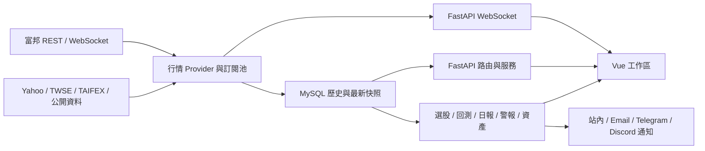

# QuantVision Pro 系統盤點與優化路線圖

盤點日期：2026-07-22（Asia/Taipei）

## 1. 本次盤點範圍

本次以實際程式碼、資料表定義、API 路由、測試與啟動腳本為準，不以舊規劃文件推測現況。掃描範圍包含：

- 後端：142 個 Python 檔案、161 個 FastAPI HTTP 路由、WebSocket、排程器、富邦行情、多來源市場資料、選股、回測、交易日誌、AI 日報、資產追蹤與紙上交易。
- 前端：157 個 Vue／JavaScript 檔案，涵蓋市場總覽、專業圖表、法人籌碼、選股、警報、通知、回測、日誌、個人資產、設定與紙上交易。
- 資料層：MySQL、57 個 `CREATE TABLE` 定義，以及啟動時欄位／索引補建機制。
- 驗證基線：本次最後一次完整測試為後端 383 項通過；前端 181 項通過、1 項略過；Vite production build 通過。

主要資料流如下：

## 2. 七項需求的處理結果

| 項目 | 原因或現況 | 已完成改善 | 後續觀測指標 |
|---|---|---|---|
| 即時 K 線延遲 | 開發啟動使用 reload、前端缺少心跳；後端過去只憑 WebSocket 模式判斷可用，未檢查單一商品資料新鮮度 | production 啟動取消 reload；加入前端 ping/pong、逾時重連、逐商品 freshness 與 REST fallback | `last_seen_at`、`age_seconds`、reconnect 次數、fallback 比例 |
| 期貨 1 分 K 重啟遺失 | 即時 candle 雖可寫入，但查詢路徑偏向重新抓上游；關閉時 queue 可能未排空，啟動補洞範圍固定 | DB-first 查詢、上游失敗仍回傳持久資料、啟動依最後一筆自動補洞、bounded queue 與 graceful drain | DB 最新時間、缺口分鐘數、queue depth、dropped count |
| `*TXFF`／`*TMFF` | 一般 ticker 正規化會破壞星號代號，搜尋結果沒有動態近月語意 | 保留動態別名、搜尋顯示目前解析合約、每次由富邦合約清單解析近月 | requested alias、resolved contract、到期日、roll 事件 |
| 富邦斷線只能重啟 | 斷線後缺少一致的 session 失效、重登入與單帳號復原流程 | 指數退避重連、認證失效重登入、單帳號／單市場重連 API 與設定頁操作 | account connected、attempt、last error、next retry |
| 個人資產難操作 | 維護頁同時顯示大量表單，導覽用卡片索引，新增卡片後容易跳錯 | 改為帳戶／現金／交易／對帳／價格／匯率／調整／匯入的單工具聚焦；保留全部工具；導覽改用穩定 section id | 任務完成時間、誤點率、表單取消率 |
| 市場產品對照 | 原系統功能多，但缺少從「發現 → 驗證 → 監控 → 檢討」的一致工作流 | 本文件建立能力差距與產品優先序 | 每週活躍策略、訊號驗證覆蓋、警報轉換率 |
| 系統自我分析 | 主要風險分散在安全、遷移、可觀測性與大型模組 | 本文件建立分級 backlog 與驗收條件 | P0 未完成數、部署失敗率、MTTR、資料新鮮度 SLO |

本次實作 commit：

- `aa080b5`：即時資料健康度與富邦復原。
- `6d5dc60`：期貨 K 線持久化優先與缺口回補。
- `817277a`：動態期貨近月別名與實體訂閱去重。
- `e5c9c60`：個人資產維護流程與 `.env` 解除追蹤。

## 3. 代表性市場產品對照

以下只比較對本系統產品方向有用的能力，不建議複製自動下單。QuantVision 應維持「研究、觀察名單、紙上交易與驗證」定位。

| 產品 | 官方資料顯示的強項 | 對 QuantVision 的啟示 |
|---|---|---|
| [TradingView Supercharts](https://www.tradingview.com/support/solutions/43000746464-getting-started-with-supercharts/) | 圖表內整合 watchlist、news、alerts、screener、calendar 與多種分析工具 | 讓使用者以「目前商品」為中心完成研究，不要在多頁間重複輸入 ticker |
| [XQ 全球贏家](https://www.xq.com.tw/feature/) | 台股價量、籌碼、財務選股；指標、腳本、回測、盤中警示與跨裝置 | 將現有 screener、backtest、signals JSON、警報串成單一策略生命週期，並保留台股／期貨在地資料優勢 |
| [TrendSpider](https://trendspider.com/) | 無程式策略測試、scanner、自動化技術分析、警報與 AI 輔助建立條件 | 建立可解釋的 no-code 條件編輯器；AI 只能產生草稿，必須先驗證資料與回測才可啟用監控 |
| [Koyfin](https://www.koyfin.com/features/) | 自訂 dashboard、跨資產市場總覽、portfolio analytics、報告與多條件 screener | 強化個人資產 benchmark、風險歸因、自訂小工具與可分享報告，而不是再增加獨立資訊卡 |
| [Finviz Elite](https://finviz.com/elite) | 快速 screener、market map、即時／盤前盤後資料、alerts、匯出與視覺化 | 優先改善篩選速度、結果欄位自訂、presets、匯出與 heatmap drill-down |
| [Fugle 行情 API](https://developer.fugle.tw/docs/pricing/) | 明確揭露 WebSocket 訂閱額度與方案差異 | 把富邦實體訂閱數、別名引用數、額度與降級原因直接顯示在系統狀態頁 |

最值得投入的差異化不是「更多指標」，而是：台股官方資料品質、期貨日／夜盤連續性、籌碼與 TAIFEX 結構化資料，以及每一個訊號可被後續驗證。

## 4. 目前系統優勢

- 功能鏈已相當完整：行情、歷史資料、選股、回測、警報、通知、日誌、資產與紙上交易都有正式 API／UI，而非單一圖表展示。
- 台灣市場深度優於多數全球型工具：TWSE／TAIFEX、法人籌碼、期貨與夜盤處理已存在。
- 資料持久化與測試基礎良好：MySQL schema、repository 分層、數百項自動測試與 production build gate 已建立。
- 日報已有結構化 signals 與後續績效驗證腳本，具備發展成「策略品質控制」的核心資料。
- 真實下單不在本系統範圍；紙上交易與風險檢查可作為安全驗證環境。

## 5. 剩餘風險與優化優先序

### P0：上線前必須處理

1. 身分驗證與 owner 隔離
   - 現況：已有 `user_profiles`／`user_preferences` 與 `owner_id`，但大多數 API 與 `/ws` 沒有登入驗證；預設 owner 為 1。CORS 允許本機與私有網段來源。
   - 風險：一旦服務暴露到區網以外，資產、設定、通知與富邦帳號操作面可能被未授權存取。
   - 建議：若維持單機，預設只 bind `127.0.0.1` 並提供明確 LAN opt-in；若支援多人，加入 session/JWT、WebSocket 驗證、owner query 強制篩選與 CSRF／rate limit。

2. 正式資料庫 migration
   - 現況：啟動時依 `INFORMATION_SCHEMA` 自動建立表、欄位與索引，沒有 migration version、down/rollback 或部署前 dry-run。
   - 風險：大型 ALTER 可能拖慢啟動，部分失敗後不易判斷資料庫處於哪個版本。
   - 建議：導入版本化 migration（例如 Alembic 或專案自有 migration table），啟動程式只驗證版本；部署流程先備份、dry-run、migrate、smoke test。

3. 機密輪替與備份還原演練
   - 本次已讓 `.env` 不再受 Git 追蹤，但 Git 歷史若曾保存真實金鑰，解除追蹤不等於撤銷金鑰。
   - 建議：輪替富邦、SMTP、Telegram、Discord 與 `APP_ENCRYPT_KEY` 相關憑證；建立 MySQL 自動備份、保留政策與每月還原測試。

### P1：可靠性與產品核心

1. 統一可觀測性
   - `/api/health` 目前只回報 process alive；scheduler health 主要顯示 task 是否存在。
   - 加入 readiness、DB pool、上游 provider、各資料集 freshness、queue depth、錯誤率、p95 latency、WebSocket 客戶端數與 reconnect 指標。
   - 建議 SLO：盤中 1 分 K 最新資料年齡小於 90 秒；95% reconnect 在 60 秒內恢復；排程資料於目標時間後 15 分鐘內完成。

2. 統一策略生命週期
   - 現有 screener、backtest、alerts、daily report 與 `signals_YYYY-MM-DD.json` 已具備零件，但尚未由同一個 strategy version 串接。
   - 建議資料模型：`strategy_definition` → `strategy_version` → `screen_run` → `signal` → `validation_1d/3d/5d/10d` → `alert`。
   - UI 應顯示每個策略的樣本數、交易成本後績效、最大回撤、失敗突破率與最近 regime，而不是只顯示單次高分候選。

3. 行情 provider circuit breaker 與補洞稽核
   - 對富邦、Yahoo、TWSE、TAIFEX 分別維護 success/error/timeout/rate-limit 狀態；連續失敗時暫停呼叫並切換可接受的備援來源。
   - 每次補洞記錄 requested range、received range、persisted rows、剩餘 gap；避免「API 成功但資料不完整」被視為健康。

4. 拆分大型模組
   - `asset_tracking_service.py`、`screener_engine.py`、`fubon_provider.py` 與大型 Vue workspace 已同時承擔多種責任。
   - 以既有 API 相容為前提，拆成 calculation、validation、persistence、orchestration 與 presentation adapters；每次只拆一個 bounded context。

### P2：差異化功能

1. 策略工作室：no-code 條件群組、參數掃描、walk-forward／out-of-sample、成本與滑價、版本比較。
2. 資產洞察：benchmark、TWR／MWR、風險貢獻、幣別曝險、股利／費用歸因、券商對帳檔 preview。
3. 研究工作區：ticker context 共用於圖表、新聞、籌碼、事件、財報、警報與筆記；保存可重用 layout。
4. 訊號品質中心：固定顯示 `confirmed_uptrend`、`new_breakout`、`watch_only`、`failed_breakout`、`invalidated`，並呈現 1／3／5／10 日驗證。
5. 可解釋 AI：只引用系統內可追溯資料，列出資料時間、缺口、分數拆解與否決原因；AI 結果一律為觀察名單，不是保證買賣建議。

## 6. 建議後續分階段順序

| Phase | 內容 | 完成條件 |
|---|---|---|
| A | 存取控制、LAN 安全模式、WebSocket 驗證 | 未登入無法讀寫私人資料；owner 隔離整合測試通過 |
| B | migration、備份／還原、環境版本檢查 | 空 DB 與既有 DB 都可升級；可在測試環境還原備份 |
| C | health/readiness/metrics 與資料 freshness dashboard | 能在不看 log 的情況定位 DB、provider、queue 或 WS 問題 |
| D | 統一策略版本、訊號與 1／3／5／10 日驗證 | 從 screener 到 validation 可完整追溯且不解析 Markdown |
| E | 資產 benchmark、績效歸因與匯入 wizard | 匯入前可 preview；總資產變化可解釋到現金流、價格、FX 與費用 |
| F | 自訂 workspace、no-code 策略與可解釋 AI | 儲存 layout／策略；AI 每項結論都有資料來源與風險提示 |

每個 Phase 延續本次交付規則：先補測試、完整回歸、production build、`git diff --check`，全部通過後才建立單一目的的 commit。

## 7. 暫不建議

- 不接真實下單；維持分析、觀察名單、警報、回測與紙上交易。
- 不在目前單一服務仍缺少 auth、migration 與完整 metrics 時提前拆微服務。
- 不以更多 AI 文案取代資料品質、樣本外驗證與風險控管。
- 不直接複製市場產品全部功能；先完成能讓現有台股／期貨優勢形成閉環的策略驗證與可靠性能力。

所有候選與 AI 產出均應視為觀察名單，不保證獲利；交易決策與風險由使用者自行承擔。
