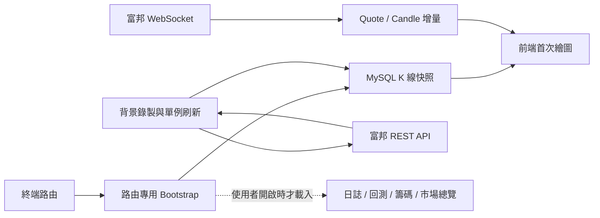

# QuantVision 終端效能與架構優化逐階段修改及驗收規畫

**版本**：v1.0

**建立日期**：2026-07-23

**適用專案**：QuantVision Pro 台股／期貨分析系統

**規畫性質**：後續實作、測試、效能比較、驗收與 Git 提交的唯一執行依據
**目前狀態**：尚未開始實作；本文件只定義範圍與 Gate，不代表功能已完成

---

## 1. 規畫目的

本規畫處理「重新整理前端終端頁後，需要較長時間才能完成 K 線與操作畫面」的問題，目標不是全面重寫系統，而是在保留既有 API、資料庫、富邦連線、分析功能與操作流程的前提下，逐步縮短：

1. 後端 K 線 API 回覆時間。
2. 終端頁首次可見時間與首次可操作時間。
3. 前端不必要的模組下載、JavaScript 解析與元件掛載成本。
4. 無關工作區 API 對終端頁冷啟動造成的阻塞。
5. 重複傳輸完整 K 線、完整市場快照與觀察池即時欄位的成本。
6. 開發伺服器被當成一般使用模式造成的額外成本。

本規畫同時建立量化驗收標準，後續每一階段必須有「修改前基準、修改後結果、測試紀錄、Git commit」才能宣告完成。

---

## 2. 2026-07-23 現況基準

### 2.1 實際終端頁冷載入

測試條件：

- 前端：`http://127.0.0.1:5173/terminal/*TMFF`
- 後端：`http://127.0.0.1:8001`
- 商品：`*TMFF`
- 週期：1 分 K
- 資料庫、前後端服務與富邦連線均使用現有本機環境

| 指標 | 現況 |
|---|---:|
| HTML load event | 約 94 ms |
| 終端殼層可見 | 約 216 ms |
| K 線完成、loading 消失 | 約 6,495 ms |
| `refresh=true` 期貨 K 線 API | 5,271～6,040 ms |
| `refresh=false` 期貨 K 線 API | 114～124 ms |
| 1 分 K 回傳筆數 | 1,497 根 |
| 1 分 K JSON 大小 | 約 284 KB |
| 終端頁開發模式 script 數 | 83 |
| `/api/watchlist` | 260～275 ms、約 50 KB |
| TSE＋OTC 完整市場快照 | 約 820 KB |
| 模擬現有啟動鏈 20 個端點依序完成 | 約 7.94 秒 |
| 相同端點並行完成 | 約 5.63 秒 |

### 2.2 已確認的主要瓶頸

1. `GET /api/futopt/ohlc/{symbol}` 在前端初始載入時使用同步富邦刷新。
2. 一般盤與盤後 K 線都完成外部請求、合併、寫入 MySQL、重新查詢後，API 才回覆。
3. `useDashboard()` 在所有工作區 mount 時依序載入工作區、警報、通知、回測、日誌、選股、觀察池、市場快照與 K 線。
4. `/terminal/...` 初始 `activeWorkspacePage` 仍是 `overview`，路由尚未套用前可能短暫掛載總覽工作區。
5. 一般啟動使用 Vite dev server，並在每次啟動執行 `npm install` 與 `pip install`。
6. 終端頁會載入 Lightweight Charts；若選用 legacy engine，之後又載入 legacy engine，兩套引擎同時進入頁面資源。
7. K 線、觀察池與市場快照回應沒有 GZip、ETag 或適當 Cache-Control。
8. 圖表只顯示約 120 根 K 棒，但初始 API 傳送並處理 1,497 根。

### 2.3 基準證據檔案

- `backend/routers/market_data.py`
- `backend/futopt_history_service.py`
- `frontend/src/App.vue`
- `frontend/src/composables/useDashboard.js`
- `frontend/src/composables/dashboard/dashboardMarketSnapshots.js`
- `frontend/src/components/ChartWorkspace.vue`
- `frontend/src/composables/useLWCChart.js`
- `frontend/vite.config.js`
- `scripts/start.bat`

---

## 3. 最終目標與驗收預算

### 3.1 使用者體感目標

| 指標 | 最終門檻 | 理想值 |
|---|---:|---:|
| 終端殼層可見 | ≤ 500 ms | ≤ 300 ms |
| 資料庫已有 K 線時，圖表完成 | p95 ≤ 1,500 ms | median ≤ 800 ms |
| DB-first 期貨 K 線 API | p95 ≤ 300 ms | median ≤ 150 ms |
| 終端初始 K 線壓縮後傳輸量 | ≤ 120 KB | ≤ 80 KB |
| production 終端初始 script | ≤ 12 個 | ≤ 8 個 |
| production 終端初始 JS gzip | ≤ 300 KB | ≤ 220 KB |
| 終端初始市場快照傳輸量 | 0 KB | 0 KB |
| 觀察池快取命中 API | p95 ≤ 150 ms | ≤ 80 ms |
| 富邦斷線但 DB 有資料的圖表完成時間 | ≤ 1,500 ms | ≤ 1,000 ms |

### 3.2 功能與資料完整性目標

- 系統重新啟動後，已保存的期貨 1 分 K 可立即從 MySQL 重建。
- DB 有資料時，富邦延遲或斷線不得阻塞終端初始畫面。
- WebSocket candle／quote 可在初始 DB snapshot 後持續更新最後一根 K 棒。
- 背景刷新同一商品、週期、交易時段只能有一個進行中的工作。
- 手動「同步」仍可要求 blocking refresh，不能移除既有能力。
- 舊 API query 參數與回應欄位維持相容；新增欄位只能是向後相容的 metadata。
- 前端 cache 只作快速顯示，MySQL 仍是正式資料來源。
- 不得增加自動下單或任何真實交易副作用。

---

## 4. 目標架構與決策

### 4.1 資料流



### 4.2 架構決策

#### A1. 保持模組化單體

- FastAPI、MySQL、Vue SPA 架構保留。
- 不因本次效能問題拆成微服務。
- 單人系統先使用程序內 TTL cache，不引入 Redis。

#### A2. 保持單一富邦 session owner

- 不以增加 Uvicorn worker 解決外部 API 延遲。
- 富邦登入、WebSocket、訂閱與重連仍由單一後端程序管理。
- 未來若要多 worker，必須先把 broker session 抽成獨立服務；不屬於本規畫。

#### A3. DB-first、背景刷新

- HTTP 初始畫面先讀 MySQL。
- 富邦 REST 僅負責背景補齊／修正尾端資料。
- DB 沒有任何可用資料時，才允許有限時間等待外部來源。

#### A4. 路由決定資料依賴

- 終端只載入終端必要資料。
- 總覽、籌碼、復盤、資產、設定各自管理第一次進入時的資料載入。
- 禁止再由單一 `onMounted()` 無條件載入所有工作區。

#### A5. production 為一般使用模式

- `start.bat` 應啟動已編譯靜態前端。
- Vite dev server 僅供開發使用。
- production 深層路由必須支援重新整理。

---

## 5. 全階段共同執行規則

1. 一次只能有一個 Phase 為 `in progress`。
2. 每個 Phase 先記錄修改前數據，再開始修改。
3. 優先修改現有函式與模組，不重寫整套系統。
4. 不刪除既有 API、報表欄位、資料表或使用者功能。
5. 若需要 migration，必須先完成已驗證的 MySQL 備份。
6. 新增 cache 時必須明確定義 TTL、失效條件、容量上限與清理機制。
7. 新增背景 task 時必須具有：
   - single-flight／去重
   - timeout
   - exception consumption
   - shutdown cleanup
   - 可觀測狀態
8. 每個 Phase 的 targeted tests 通過後，必須再跑全域 Gate。
9. 全域 Gate 通過後才可建立該 Phase Git commit。
10. `.env`、API Key、帳密、憑證與 `.codex/config.toml` 不得加入 commit。

### 5.1 固定全域 Gate

```powershell
python -m compileall backend
python -m pytest backend/tests -q

Set-Location frontend
npm test -- --run
npm run build
Set-Location ..

git diff --check
git status --short
```

### 5.2 Git 規格

建議每階段 commit：

- `perf-phase-0: add terminal performance baselines`
- `perf-phase-1: make futures chart loading database first`
- `perf-phase-2: scope dashboard bootstrap by route`
- `perf-phase-3: reduce api payload and repeated hydration`
- `perf-phase-4: load only the selected chart engine`
- `perf-phase-5: serve production spa by default`
- `perf-phase-6: add client cache and performance telemetry`

---

## 6. Phase 0：效能量測工具與回歸基準

### 6.1 目的

把目前人工量測轉成可重複執行的基準，避免後續只看單次結果或主觀感覺。

### 6.2 預定修改

- 新增 `scripts/benchmark-terminal.ps1`
- 新增 `backend/performance_timing.py` 或等價 request timing middleware
- 新增 `backend/tests/test_performance_timing.py`
- 前端增加最小化 `performance.mark()`：
  - `qv:app-mounted`
  - `qv:terminal-visible`
  - `qv:chart-data-ready`
  - `qv:chart-painted`
- 新增 `docs/performance/`，保存不含帳密與個資的 JSON 結果

### 6.3 量測腳本輸出

每次至少輸出：

- 測試日期、Git commit、商品、週期、資料筆數。
- API status、TTFB、total time、response bytes、content encoding。
- 3 次 cold run 與 5 次 warm run。
- median、p95、最慢值。
- 前端 shell、terminal、chart ready 時間。

### 6.4 後端 timing header

建議回應：

```text
Server-Timing: db;dur=118.4, provider;dur=0, serialize;dur=19.2, total;dur=143.8
X-Request-ID: <local-generated-id>
```

不得在 timing header 放入帳號、商品部位、SQL、API key 或錯誤堆疊。

### 6.5 測試

- middleware 對正常與例外回應都保留 request ID。
- timing 數值必須為非負數。
- benchmark 在 API 不可用時要明確失敗，不得把失敗當成 0 ms。
- JSON 輸出不得包含設定值或敏感資料。

### 6.6 驗收 Gate

- [ ] 可用單一命令重現第 2 節基準。
- [ ] 結果包含 cold／warm、median／p95 與 bytes。
- [ ] 不改變任何交易、行情或資料庫業務邏輯。
- [ ] targeted tests 與全域 Gate 通過。
- [ ] Git commit 完成。

---

## 7. Phase 1：期貨 K 線 DB-first 與 stale-while-revalidate

### 7.1 目的

把 5～6 秒富邦 REST 刷新移出終端初始請求，先用 MySQL 資料繪圖，再由背景工作與 WebSocket 更新。

### 7.2 預定修改檔案

- `backend/routers/market_data.py`
- `backend/futopt_history_service.py`
- `backend/tests/test_futopt_market_data_api.py`
- `backend/tests/test_futopt_history_service.py`
- `backend/tests/test_futopt_candle_recorder.py`
- `frontend/src/api/dashboardApi.js`
- `frontend/src/api/dashboardApi.spec.js`
- `frontend/src/composables/useDashboard.js`
- `frontend/src/composables/useDashboard.spec.js`

### 7.3 API 相容策略

保留既有 `refresh=true|false` 行為，避免舊客戶端失效；新增明確模式，例如：

```text
GET /api/futopt/ohlc/*TMFF?period=1d&interval=1m&refresh_mode=background
```

建議模式：

| 模式 | 行為 |
|---|---|
| `none` | 只讀 DB，不呼叫富邦 |
| `background` | 先回 DB；資料過舊時建立去重背景刷新 |
| `blocking` | 等待富邦同步後回傳；供手動同步或維護使用 |

映射規則：

- 舊 `refresh=false` → `none`
- 舊 `refresh=true` → `blocking`
- 新前端初始載入 → `background`
- 手動同步按鈕 → 現有 `POST /api/futopt/sync/{symbol}` 或 `blocking`

### 7.4 背景刷新協調器

single-flight key 至少包含：

```text
canonical_symbol + interval + session
```

行為要求：

1. 相同 key 同時間只有一個 task。
2. DB 有資料時直接回傳，不等待背景 task。
3. DB 無資料時可等待背景 task，但不得超過設定 timeout。
4. task 完成後移除 registry。
5. task exception 必須被讀取並記錄，不得產生未處理例外。
6. shutdown 時取消並等待所有 task。
7. 富邦失敗時保留 DB 舊資料與可讀 metadata。

### 7.5 回應 metadata

向後相容新增：

```json
{
  "data_source": "database",
  "refresh_mode": "background",
  "refresh_status": "running",
  "is_stale": false,
  "latest_date": "2026-07-23T09:41:00+08:00",
  "data_age_seconds": 12.4
}
```

### 7.6 前端行為

- 初始請求不得使用 blocking refresh。
- DB snapshot 收到後立刻解除 chart loading。
- `refresh_status=running` 時只顯示小型「背景更新中」，不遮住圖表。
- WebSocket candle 到達後合併最後一根或新增一根。
- 背景刷新完成不需重新下載全部資料；下一階段將改用增量 API。
- 手動同步仍顯示明確 loading、成功或失敗訊息。

### 7.7 必測案例

- DB 有 1 分 K、富邦回應慢：API 仍快速回 DB。
- DB 有資料、富邦丟例外：200 回傳 DB 資料並標示 stale／failed。
- DB 無資料、富邦成功：timeout 內回傳新資料。
- DB 無資料、富邦 timeout：明確 404／502，不可無限等待。
- 5 個相同並行請求只觸發一次 provider call。
- 不同商品或 interval 可各自刷新。
- background task 完成後可再次刷新。
- 系統 shutdown 無殘留 task。
- blocking 模式維持舊行為。

### 7.8 驗收 Gate

- [ ] `background` API p95 ≤ 300 ms（DB 已有資料）。
- [ ] 前端 K 線 loading median ≤ 1 秒。
- [ ] 富邦斷線時仍可看到 DB K 線。
- [ ] 手動同步功能未被移除。
- [ ] WebSocket 可更新初始 DB snapshot。
- [ ] 期貨 1 分 K 重啟後仍由 MySQL 讀回。
- [ ] targeted tests 與全域 Gate 通過。
- [ ] Git commit 完成。

---

## 8. Phase 2：依路由載入資料與消除初始化瀑布

### 8.1 目的

終端頁不再先掛載總覽，也不再等待日誌、回測、選股或完整市場快照。

### 8.2 預定修改檔案

- `frontend/src/App.vue`
- `frontend/src/App.spec.js`
- `frontend/src/views/AppShellRouteView.vue`
- `frontend/src/views/AppShellRouteView.spec.js`
- `frontend/src/composables/useDashboard.js`
- 新增 `frontend/src/composables/dashboard/dashboardBootstrap.js`
- 新增 `frontend/src/composables/dashboard/dashboardBootstrap.spec.js`
- 視需要調整既有 dashboard 子 composable

### 8.3 路由優先初始化

- `activeWorkspacePage` 初值直接由 `routeWorkspaceTab` 正規化產生。
- `applyIncomingRouteState()` 先套用 workspace page 與 ticker state，再開始非必要網路工作。
- 不得等待 `selectTicker()` 全部 API 完成才顯示正確工作區。
- route ticker 與 localStorage ticker 不同時，舊 ticker 的結果不得覆寫新 ticker。

### 8.4 路由資源矩陣

| 資源 | 終端 | 總覽 | 籌碼 | 復盤 | 資產 | 設定 |
|---|---:|---:|---:|---:|---:|---:|
| WebSocket 連線 | 必要 | 必要 | 視功能 | 否 | 否 | 狀態即可 |
| 當前商品 K 線 | 必要 | 延後 | 視需求 | 視需求 | 否 | 否 |
| 工作區 presets | 必要 | 否 | 否 | 否 | 否 | 否 |
| 觀察池設定 | 精簡必要 | 必要 | 視需求 | 視需求 | 否 | 否 |
| 警報完整清單 | drawer 開啟才載入 | 建立警報時 | 建立警報時 | 否 | 否 | 否 |
| 通知 | idle／背景 | idle／背景 | idle／背景 | idle／背景 | idle／背景 | idle／背景 |
| 市場快照 | 不得載入 | 必要 | 否 | 否 | 否 | 否 |
| 回測歷史 | 不得載入 | 否 | 否 | backtest tab | 否 | 否 |
| 日誌 | drawer／journal tab | 使用時 | 使用時 | journal tab | 匯入時 | 否 |
| 選股 presets／結果 | 不得載入 | screener 區塊 | 否 | 否 | 否 | 否 |
| 資產資料 | 不得載入 | 否 | 否 | 否 | 必要 | 否 |

### 8.5 Bootstrap 執行順序

終端 critical path：

1. 同步建立 Vue shell 與正確 route state。
2. 連接 WebSocket 並訂閱當前 ticker。
3. 使用 `Promise.allSettled()` 並行讀取：
   - DB-first K 線
   - 工作區 presets
   - 精簡觀察池設定
4. K 線一到即繪圖，不等待其他兩項。
5. 通知、警報摘要等使用 idle／非阻塞載入。
6. drawer、日誌、回測等在第一次打開時載入。

### 8.6 請求治理

- 每類資源維護 `idle / loading / ready / error / loadedAt`。
- 相同 query 必須 single-flight。
- ticker／期間改變時使用 `AbortController` 中止舊 HTTP 請求。
- 即使無法中止，回應套用前也要比對 request token。
- route 切換不得讓已離開頁面的結果觸發大型重繪。
- visibility poller 只能刷新目前頁面需要的資源。

### 8.7 必測案例

- `/terminal/*TMFF` 第一個 workspace 必須是 terminal。
- 終端 mount 不得建立 MarketOverviewWorkspace。
- 終端初始不得請求市場快照、日誌、回測、選股。
- 進入總覽後才請求市場快照。
- 第一次打開 journal drawer 才讀取日誌。
- 快速切換 A→B 時，A 的慢回應不能覆寫 B。
- 同一資源兩個元件同時要求時只發出一個請求。
- 任一非必要請求失敗不阻塞 K 線。

### 8.8 驗收 Gate

- [ ] 終端不再閃現總覽頁。
- [ ] 終端初始市場快照傳輸量為 0。
- [ ] 終端初始不載入日誌、回測與選股資料。
- [ ] 必要請求並行，沒有長串 `await` waterfall。
- [ ] route 快速切換無舊資料覆寫。
- [ ] targeted tests 與全域 Gate 通過。
- [ ] Git commit 完成。

---

## 9. Phase 3：API payload、壓縮、增量讀取與快取

### 9.1 目的

降低 MySQL 查詢、JSON serialization、網路傳輸與前端解析成本。

### 9.2 預定修改檔案

- `backend/main.py`
- `backend/routers/market_data.py`
- `backend/routers/watchlist.py`
- `backend/repositories/market_data.py`
- `backend/repositories/watchlist.py`
- 視結果新增 `backend/cache.py`
- 對應 backend tests
- `frontend/src/api/dashboardApi.js`
- `frontend/src/composables/useDashboard.js`
- `frontend/src/composables/dashboard/dashboardMarketSnapshots.js`
- 對應 frontend tests

### 9.3 K 線限制與增量 API

新增向後相容 query：

```text
limit=400
since=2026-07-23T09:30:00+08:00
warmup=250
```

規則：

- 未提供 `limit` 時保留舊回應行為。
- 新終端初始請求使用足以計算最長指標的資料量。
- 畫面預設顯示 120 根，但保留至少 250 根 warm-up。
- 後續 REST fallback 只取得 `since` 之後資料。
- 前端使用 ticker＋interval＋date 去重，維護有上限的 ring buffer。
- WebSocket 繼續作為最新 candle 的主要增量來源。

### 9.4 HTTP 壓縮

- FastAPI 加入 GZip middleware。
- 建議 minimum size：1 KB。
- 不重複壓縮已壓縮內容。
- 測試 `Accept-Encoding: gzip` 時大型 JSON 有 `Content-Encoding: gzip`。
- 即時 API 可使用 `no-store`；不要為了 ETag 快取錯誤的即時價格。

### 9.5 市場快照精簡

保留現有完整 snapshot API，新增摘要用途：

```text
GET /api/fubon/snapshot/{market}/summary
```

只回傳：

- count、advancers、decliners、unchanged
- total_trade_value
- snapshot date／time／source／freshness

總覽的 top movers／actives 仍使用既有小型端點，不得為了摘要傳輸全部股票。

### 9.6 觀察池拆分

目標拆成：

1. 群組、順序、標籤、顏色、商品名稱等低頻 metadata。
2. 最新價格、漲跌、成交量等高頻 quote state。

策略：

- 初次載入可由精簡 metadata API 建立 UI。
- 即時 quote 由 WebSocket 合併。
- 舊 `/api/watchlist` 保留，避免破壞相容性。
- hydration 結果可使用程序內 TTL cache。

### 9.7 TTL cache 規範

| 資料 | 建議 TTL | 主動失效條件 |
|---|---:|---|
| Watchlist metadata | 30 秒 | 新增、刪除、改名、排序 |
| 市場 snapshot summary | 5～15 秒 | 強制 refresh 成功 |
| Workspace list | 30 秒 | 新增、更新、刪除 |
| OHLC DB query | 不跨即時更新長期快取 | 新 candle 寫入或 since query |

所有 cache 必須：

- 有最大 entry 數量。
- 使用 monotonic time 判斷 TTL。
- 不快取 exception。
- 不把 cache 當正式資料來源。
- 測試失效與並行 single-flight。

### 9.8 索引與 SQL Gate

修改前先用 `EXPLAIN` 確認：

- `ohlcv(ticker, interval, date)` 可支援倒序 limit／since。
- watchlist group／item 查詢不做 N+1。
- 不因新 query 加入全表掃描。

只有缺少必要索引時才新增 migration；不得重建整張大型 OHLCV 表。

### 9.9 驗收 Gate

- [ ] 初始 K 線壓縮後 ≤ 120 KB。
- [ ] 初始資料筆數符合 warm-up 需求，不再固定傳 1,497 根。
- [ ] REST fallback 只傳增量資料。
- [ ] 大型 JSON 支援 GZip。
- [ ] 終端不下載完整市場 snapshot。
- [ ] watchlist cache 命中 p95 ≤ 150 ms。
- [ ] 舊 API 仍可使用。
- [ ] targeted tests 與全域 Gate 通過。
- [ ] Git commit 完成。

---

## 10. Phase 4：圖表引擎互斥載入與前端渲染治理

### 10.1 目的

終端只下載、初始化與計算實際選用的圖表引擎。

### 10.2 預定修改檔案

- `frontend/src/components/ChartWorkspace.vue`
- `frontend/src/components/ChartWorkspace.spec.js`
- 新增或拆分：
  - `frontend/src/components/chart/LegacyChartHost.vue`
  - `frontend/src/components/chart/LwcChartHost.vue`
- `frontend/src/composables/useChartEngine.js`
- `frontend/src/composables/useLWCChart.js`
- `frontend/src/composables/useLWCIndicators.js`
- `frontend/vite.config.js`

### 10.3 引擎拆分

- `ChartWorkspace` 只保留工具列、metadata、共用狀態與 async host。
- `engineMode=legacy`：只 import LegacyChartHost 與 `useChartEngine`。
- `engineMode=lwc`：只 import LwcChartHost、Lightweight Charts 與 LWC indicators。
- 未選用的 host 不建立 watcher、computed、canvas、ResizeObserver 或 keyboard listener。
- 使用者切換引擎時才載入另一個 chunk。

### 10.4 計算與渲染限制

- 圖表與指標只處理 Phase 3 定義的 bounded buffer。
- 最後一根即時更新走 incremental path，不重建所有 series。
- 多 pane 指標只計算啟用項目。
- resize 合併到單一 animation frame，不建立重複 timer。
- route 離開時 observer、listener、animation frame 與 chart instance 必須完全清理。

### 10.5 Web Worker 決策 Gate

完成 payload 限制與引擎拆分後重新量測指標計算：

- 若主執行緒單次指標計算 p95 ≤ 50 ms：不引入 Worker。
- 若仍 > 50 ms 或產生 > 100 ms long task：把純計算的 indicator model 移到 Web Worker。
- Worker 只接收結構化 OHLCV 與設定，不接觸 Vue state／DOM。
- Worker 回應必須含 request token，避免舊 ticker 結果覆寫。

### 10.6 必測案例

- legacy 模式 bundle 不載入 `lightweight-charts`。
- LWC 模式 bundle 不載入 legacy engine。
- 切換引擎後 K 線、指標與視窗範圍正確。
- 反覆切換 20 次不增加 listener／observer／timer。
- 即時更新最後一根不觸發完整資料重建。
- 路由離開終端後圖表 instance 已銷毀。

### 10.7 驗收 Gate

- [ ] 初始只載入一套圖表引擎。
- [ ] production 終端初始 script ≤ 12。
- [ ] production 終端初始 JS gzip ≤ 300 KB。
- [ ] 無 > 200 ms 的圖表初始化 long task。
- [ ] 重複切換引擎無資源洩漏。
- [ ] targeted tests 與全域 Gate 通過。
- [ ] Git commit 完成。

---

## 11. Phase 5：production SPA、啟動流程與靜態資源快取

### 11.1 目的

一般使用不再啟動 Vite dev server，也不再於每次啟動安裝全部依賴。

### 11.2 預定修改檔案

- `scripts/start.bat`
- 新增 `scripts/start-dev.bat`
- 新增 `scripts/setup.bat`
- 新增 `scripts/build-frontend.bat`
- `backend/main.py`
- `backend/routers/system.py`
- 新增 `backend/tests/test_frontend_static_hosting.py`
- `frontend/vite.config.js`
- `frontend/src/router/index.js`
- `README.md`

### 11.3 一般模式

- 預設只啟動後端服務。
- 前端使用 `frontend/dist`，由 FastAPI `/app/` 提供。
- `frontend/dist/index.html` 不存在時明確提示先執行 build；不得靜默退回 dev server。
- 一般啟動不得自動執行 `npm install`、`pip install --upgrade pip` 或完整 requirements 安裝。
- 套件安裝移到明確 setup／upgrade 流程。

### 11.4 開發模式

- `start-dev.bat` 才啟動 Vite 5173。
- 後端仍維持本機安全邊界。
- README 清楚區分一般使用與開發模式。

### 11.5 SPA deep-link fallback

以下路徑直接重新整理都必須回傳 `index.html`：

- `/app/overview/2330.TW`
- `/app/terminal/*TMFF`
- `/app/institutional/2330.TW`
- `/app/review/journal/2330.TW`
- `/app/assets/2330.TW`
- `/app/settings/2330.TW`

但 `/app/assets/<hashed-file>` 找不到時必須維持 404，不得錯回 index.html。

Vue Router 使用與 Vite base 相同的 base，例如：

```js
createWebHistory(import.meta.env.BASE_URL)
```

### 11.6 靜態快取規則

| 資源 | Cache-Control |
|---|---|
| `index.html` | `no-cache` |
| hashed JS／CSS | `public, max-age=31536000, immutable` |
| 自有字型 | `public, max-age=31536000, immutable` |
| API | 依各 endpoint freshness 決定，不套用靜態規則 |

Google Fonts 建議改為本機 WOFF2 並設定 `font-display: swap`，避免外部 CDN 影響首次繪圖。

### 11.7 必測案例

- `/app/` 正常載入。
- 所有 deep route 直接 GET 為 200 HTML。
- 不存在的 hashed asset 為 404。
- API route 不被 SPA fallback 攔截。
- hashed asset 有 immutable header。
- index 無長期快取。
- 一般 `start.bat` 不啟動 Node process。
- dev script 仍支援 HMR。

### 11.8 驗收 Gate

- [ ] 一般使用只需一個 URL 與一個後端程序。
- [ ] `/app/terminal/*TMFF` 可直接重新整理。
- [ ] 一般啟動不執行依賴安裝。
- [ ] production cache header 正確。
- [ ] cold／warm browser 驗收通過。
- [ ] targeted tests 與全域 Gate 通過。
- [ ] Git commit 完成。

---

## 12. Phase 6：前端快取、失效策略與最終可觀測性

### 12.1 目的

讓重新整理時可先看到最近一次資料，同時保留 MySQL 與即時來源作為正式依據。

### 12.2 預定修改

- 新增 `frontend/src/services/terminalCache.js`
- 新增 `frontend/src/services/terminalCache.spec.js`
- 調整 terminal bootstrap 與 K 線載入流程
- 調整 StatusBar／K 線 metadata，顯示 cache／DB／WebSocket 狀態
- 完成 Phase 0 timing dashboard 或診斷輸出

### 12.3 IndexedDB cache 範圍

允許保存：

- 最近使用 ticker 的 bounded OHLCV snapshot。
- workspace UI preferences。
- watchlist metadata snapshot。
- snapshot 版本、保存時間、latest candle time。

不得保存：

- API key、帳號密碼、憑證。
- 未加密的個人敏感設定。
- 可取代 MySQL 的唯一正式資產或交易紀錄。

### 12.4 Cache 套用順序

1. 路由解析完成。
2. 若 IndexedDB 有同 ticker／interval／schema version，先畫 cache 並標示「快取資料」。
3. 並行向後端要求 DB-first snapshot。
4. DB 回應後取代／合併 cache，標示「資料庫資料」。
5. WebSocket 更新後標示「即時」。

### 12.5 失效條件

- schema version 不同。
- ticker／interval 不同。
- cache 超過容量上限。
- 資料日期無法解析或出現倒序。
- 使用者執行清除本機資料。
- 後端回傳 invalidated／repair metadata。

### 12.6 最終韌性驗收

- 富邦正常。
- 富邦 REST 延遲 10 秒。
- 富邦完全斷線。
- WebSocket 中斷後重連。
- MySQL 有資料但 cache 空。
- cache 有資料但 MySQL 更新。
- cache 損壞或 schema version 過期。
- 系統重啟後期貨 1 分 K 重建。
- 連續重新整理 20 次無 task／timer／connection 洩漏。

### 12.7 驗收 Gate

- [ ] cache 可先畫面但不會覆蓋較新的 DB 資料。
- [ ] cache 狀態對使用者可辨識。
- [ ] cache 損壞時安全忽略。
- [ ] 不保存秘密或正式個人交易帳務。
- [ ] 最終效能預算全部達標。
- [ ] 全域 Gate、真實 DB smoke 與 browser smoke 通過。
- [ ] Git commit 完成。

---

## 13. 完整測試矩陣

### 13.1 Backend unit／service tests

- refresh mode 正規化與舊參數相容。
- DB-first 回傳與 stale metadata。
- single-flight background refresh。
- provider timeout／exception fallback。
- task cleanup 與 shutdown。
- OHLC limit／since／warmup。
- GZip response。
- TTL cache 命中、過期、失效與容量上限。
- market summary 不含完整股票陣列。
- static fallback 與 cache headers。

### 13.2 Backend integration tests

- 真實 MySQL 查詢計畫與索引。
- 既有 1 分 K 在重啟後可讀回。
- 手動 blocking sync 寫回 DB。
- background sync 不阻塞 GET。
- 併行五個 GET 只有一個富邦 refresh。
- `/api/ready`、資料品質與備份健康維持正常。

### 13.3 Frontend unit tests

- route-first workspace。
- route resource matrix。
- 請求去重與 AbortController。
- stale response token。
- background refresh UI。
- bounded OHLC merge。
- engine chunk 互斥。
- route 離開清理。
- IndexedDB version／失效／fallback。

### 13.4 Browser acceptance

至少測試：

1. `/app/terminal/*TMFF` cold reload。
2. `/app/terminal/*TMFF` warm reload。
3. `*TMFF`、`*TXFF` 與一個具體期貨合約。
4. 1m、5m、15m。
5. 富邦正常與模擬 timeout。
6. 快速切換商品 10 次。
7. terminal ↔ overview ↔ assets 反覆切換。
8. legacy ↔ LWC 反覆切換。
9. 20 次 reload 後檢查 timer、WebSocket、背景 task。

### 13.5 不可退化功能

- 五檔即時資料。
- `*TMFF`／`*TXFF` 自動解析。
- 期貨 1 分 K 持久化。
- 富邦 reconnect 與訂閱恢復。
- 工作區儲存／載入。
- 畫線、指標、比較標的。
- 警報與交易日誌。
- 個人資產頁面。
- 觀察池群組、排序與標籤。

---

## 14. 效能驗收方法

### 14.1 每階段固定條件

- 使用相同電腦與本機 MySQL。
- 測試前記錄富邦連線狀態。
- 商品固定包含 `*TMFF`。
- 1 分 K 資料庫至少有 1,000 根資料。
- cold run 先清除該頁 HTTP memory cache，但不得清除正式資料庫。
- warm run 保留正常瀏覽器 cache。
- 每組至少 3 次 cold、5 次 warm。
- 不得只挑最快的一次作為結果。

### 14.2 結果紀錄格式

```json
{
  "commit": "<git-sha>",
  "ticker": "*TMFF",
  "interval": "1m",
  "database_rows": 1497,
  "fubon_connected": true,
  "api_p50_ms": 120,
  "api_p95_ms": 180,
  "terminal_visible_ms": 260,
  "chart_ready_ms": 780,
  "response_bytes": 78000,
  "content_encoding": "gzip"
}
```

### 14.3 Gate 判定

- 任一功能正確性測試失敗：Phase 失敗。
- p95 未達該 Phase 門檻：Phase 不可宣告完成，需說明原因並繼續改善。
- 外部富邦服務不穩定時，DB-first 測試仍必須通過。
- blocking refresh 的外部時間只作紀錄，不作初始畫面效能 Gate。

---

## 15. 風險與回滾

### R1. 背景刷新造成資料比畫面慢一小段時間

控制方式：顯示資料時間與 refresh status；WebSocket 優先補最新 candle。

回滾：前端可暫時切回 `blocking`，但不得刪除 DB-first 實作與測試。

### R2. limit 太小導致長週期指標不準

控制方式：以最長啟用指標決定 warm-up，至少覆蓋 MA200／Ichimoku 等需求。

回滾：調高 bounded limit，不恢復無限制資料。

### R3. Cache 回傳過期資料

控制方式：TTL、版本、資料時間、明確 stale UI、mutation 主動失效。

回滾：停用 cache feature flag，回到直接 DB-first。

### R4. SPA fallback 攔截 API 或靜態檔 404

控制方式：API route 優先；只對 `/app/` 非 asset 路徑 fallback。

回滾：恢復舊 static mount，開發模式仍可用於緊急操作。

### R5. 圖表引擎拆分造成狀態不一致

控制方式：定義共用 engine contract，保留 timeframe、drawing、scale 狀態轉換測試。

回滾：以 feature flag 固定 legacy 或 LWC 單一引擎。

---

## 16. 最終交付清單

- [ ] Phase 0 基準與量測工具。
- [ ] Phase 1 DB-first／背景期貨刷新。
- [ ] Phase 2 路由專用 bootstrap。
- [ ] Phase 3 bounded／incremental／compressed API。
- [ ] Phase 3 精簡市場快照與觀察池快取。
- [ ] Phase 4 圖表引擎互斥載入。
- [ ] Phase 5 production SPA 與啟動流程。
- [ ] Phase 6 IndexedDB 快速顯示與 telemetry。
- [ ] 每階段 targeted tests 紀錄。
- [ ] 每階段全域 Gate 紀錄。
- [ ] 每階段 Git commit。
- [ ] 最終真實 MySQL API smoke。
- [ ] 最終 browser cold／warm smoke。
- [ ] 最終富邦斷線／重連韌性測試。
- [ ] README 操作方式更新。

全部項目完成後，才可將本規畫狀態更新為「已完成」。未達效能門檻但功能正常的項目，必須標示為「部分完成」並保留原因、測量值與後續工作，不得直接勾選完成。
